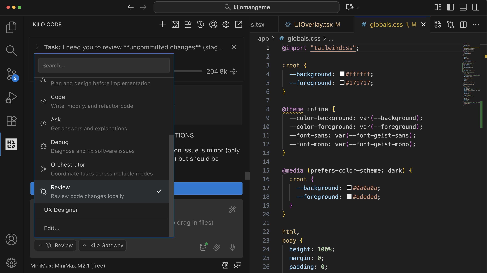

# Local Code Reviews

Code Reviewer is also available locally. This is valuable for developers who want to review their code before pushing a pull request to their team publicly, or for developers who want reviews and don't need to ship a pull request to GitHub.

Select 'Review' from the mode dropdown after making local changes, and click 'Send' for AI-powered feedback and suggestions.

_Review Mode_
