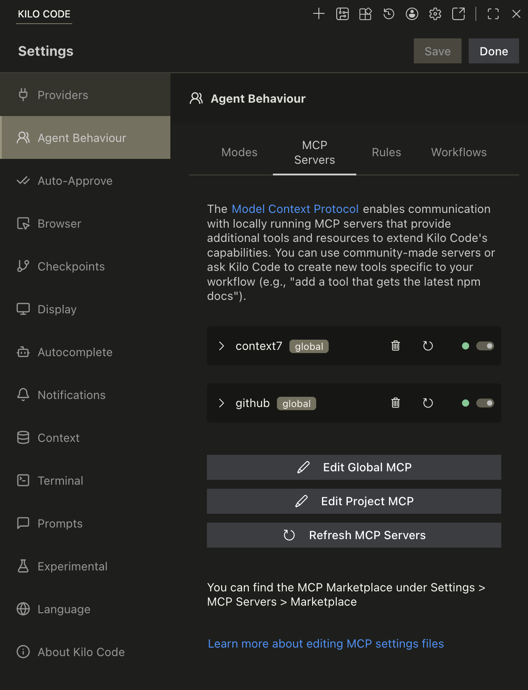
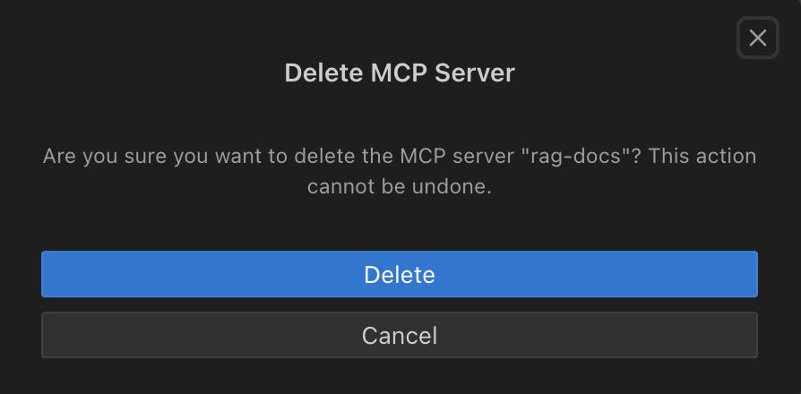
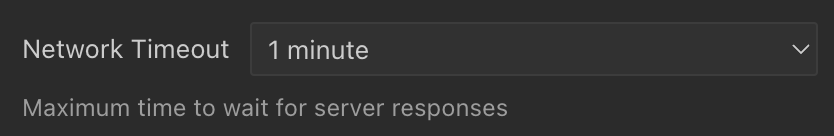

# Using MCP in Kilo Code

Model Context Protocol (MCP) extends Kilo Code's capabilities by connecting to external tools and services. This guide covers everything you need to know about using MCP with Kilo Code.

## Configuring MCP Servers

MCP server configurations can be managed at two levels: **global** (applies across all workspaces) and **project-level** (specific to a single project). Project-level configuration takes precedence over global settings.

| Scope       | Path                 | Description                                                     |
| ----------- | -------------------- | --------------------------------------------------------------- |
| **Global**  | `mcp_settings.json`  | Accessible via VS Code settings. Applies across all workspaces. |
| **Project** | `.kilocode/mcp.json` | In your project root. Auto-detected by Kilo Code.               |

Project-level configs can be committed to version control to share with your team.

## Configuration Format

Both global and project-level files use a JSON format with a `mcpServers` object containing named server configurations:

```json
{
	"mcpServers": {
		"server1": {
			"command": "python",
			"args": ["/path/to/server.py"],
			"env": {
				"API_KEY": "your_api_key"
			},
			"alwaysAllow": ["tool1", "tool2"],
			"disabled": false
		}
	}
}
```

_Example of MCP Server config in Kilo Code (STDIO Transport)_

## Understanding Transport Types

MCP supports two main transport types:

- **Local (STDIO)**: Servers run as a child process on your machine, communicating over stdin/stdout.
- **Remote (HTTP/SSE)**: Servers hosted over HTTP/HTTPS. Kilo Code tries `StreamableHTTP` first, then falls back to `SSE` automatically.

For more details, see [STDIO and SSE transports](https://kilo.ai/docs/automate/mcp/server-transports).

### STDIO Transport

Used for local servers running on your machine:

- Communicates via standard input/output streams
- Lower latency (no network overhead)
- Better security (no network exposure)
- Simpler setup (no HTTP server needed)
- Runs as a child process on your machine

For more in-depth information about how STDIO transport works, see [STDIO transport](https://kilo.ai/docs/automate/mcp/server-transports#stdio-transport).

STDIO configuration example:

```json
{
	"mcpServers": {
		"local-server": {
			"command": "node",
			"args": ["/path/to/server.js"],
			"env": {
				"API_KEY": "your_api_key"
			},
			"alwaysAllow": ["tool1", "tool2"],
			"disabled": false
		}
	}
}
```

### Streamable HTTP Transport

Used for remote servers accessed over HTTP/HTTPS:

- Can be hosted on a different machine
- Supports multiple client connections
- Requires network access
- Allows centralized deployment and management

```json
{
	"mcpServers": {
		"remote-server": {
			"type": "streamable-http",
			"url": "https://your-server-url.com/mcp",
			"headers": {
				"Authorization": "Bearer your-token"
			},
			"alwaysAllow": ["tool3"],
			"disabled": false
		}
	}
}
```

### SSE Transport

    ⚠️ DEPRECATED: The SSE Transport has been deprecated as of MCP specification version 2025-03-26. Please use the HTTP Stream Transport instead, which implements the new Streamable HTTP transport specification.

Used for remote servers accessed over HTTP/HTTPS:

- Communicates via Server-Sent Events protocol
- Can be hosted on a different machine
- Supports multiple client connections
- Requires network access
- Allows centralized deployment and management

For more in-depth information about how SSE transport works, see [SSE transport](https://kilo.ai/docs/automate/mcp/server-transports#sse-transport).

SSE configuration example:

```json
{
	"mcpServers": {
		"remote-server": {
			"url": "https://your-server-url.com/mcp",
			"headers": {
				"Authorization": "Bearer your-token"
			},
			"alwaysAllow": ["tool3"],
			"disabled": false
		}
	}
}
```

## Managing MCP Servers

### Editing MCP Settings Files

You can edit both global and project-level MCP configuration files directly from the Kilo Code settings.

1. Click the gear icon icon in the top navigation of the Kilo Code pane to open `Settings`.
2. Click the `Agent Behaviour` tab on the left side
3. Select the `MCP Servers` sub-tab
4. Click the appropriate button:
    - **`Edit Global MCP`**: Opens the global `mcp_settings.json` file.
    - **`Edit Project MCP`**: Opens the project-specific `.kilocode/mcp.json` file. If this file doesn't exist, Kilo Code will create it for you.


_Edit Global MCP and Edit Project MCP buttons_

### Deleting a Server

1. Press the trash icon next to the MCP server you would like to delete
2. Press the `Delete` button on the confirmation box


_Delete confirmation box_

### Restarting a Server

1. Press the refresh icon button next to the MCP server you would like to restart

### Enabling or Disabling a Server

1. Press the activate icon toggle switch next to the MCP server to enable/disable it

### Network Timeout

To set the maximum time to wait for a response after a tool call to the MCP server:

1. Click the `Network Timeout` pulldown at the bottom of the individual MCP server's config box and change the time. Default is 1 minute but it can be set between 30 seconds and 5 minutes.


_Network Timeout pulldown_

### Auto Approve Tools

MCP tool auto-approval works on a per-tool basis and is disabled by default. To configure auto-approval:

1. First enable the global "Use MCP servers" auto-approval option in [auto-approving-actions](../../getting-started/settings/auto-approving-actions.md)
2. Navigate to Settings > Agent Behaviour > MCP Servers, then locate the specific tool you want to auto-approve
3. Check the `Always allow` checkbox next to the tool name


_Always allow checkbox for MCP tools_

When enabled, Kilo Code will automatically approve this specific tool without prompting. Note that the global "Use MCP servers" setting takes precedence - if it's disabled, no MCP tools will be auto-approved.

## Platform-Specific Local Server Commands

Local MCP server instructions are often written as shell commands, such as `npx -y @modelcontextprotocol/server-puppeteer`. Use the right command format for your operating system.

### Windows

Use `cmd` as the command and put the rest of the invocation in `args`:

```json
{
	"mcpServers": {
		"puppeteer": {
			"command": "cmd",
			"args": ["/c", "npx", "-y", "@modelcontextprotocol/server-puppeteer"]
		}
	}
}
```

### macOS and Linux

Use `npx` directly:

```json
{
	"mcpServers": {
		"puppeteer": {
			"command": "npx",
			"args": ["-y", "@modelcontextprotocol/server-puppeteer"]
		}
	}
}
```

## Finding and Installing MCP Servers

Kilo Code does not come with any pre-installed MCP servers. You'll need to find and install them separately.

- **Kilo Marketplace:** Browse community-contributed MCP server configurations and agent skills in the [Kilo Marketplace](https://github.com/Kilo-Org/kilo-marketplace). The marketplace includes ready-to-use configs for popular tools like Figma, Sentry, and more.
- **Community Repositories:** Check for community-maintained lists of MCP servers on GitHub
- **Ask Kilo Code:** You can ask Kilo Code to help you find or even create MCP servers
- **Build Your Own:** Create custom MCP servers using the SDK to extend Kilo Code with your own tools

For full SDK documentation, visit the [MCP GitHub repository](https://github.com/modelcontextprotocol/).

## Using MCP Tools in Your Workflow

After configuring an MCP server, Kilo Code will automatically detect available tools and resources. To use them:

1. Type your request in the Kilo Code chat interface
2. Kilo Code will identify when an MCP tool can help with your task
3. Approve the tool use when prompted (or use auto-approval)

Example: "Analyze the performance of my API" might use an MCP tool that tests API endpoints.

## Troubleshooting MCP Servers

- **Server Not Responding:** Check if the server process is running and verify network connectivity
- **Permission Errors:** Ensure proper API keys and credentials are configured in your `mcp_settings.json` (for global settings) or `.kilocode/mcp.json` (for project settings).
- **Tool Not Available:** Confirm the server is properly implementing the tool and it's not disabled in settings
- **Slow Performance:** Try adjusting the network timeout value for the specific MCP server

> **Tip:** > **Reduce system prompt size:** If you're not using MCP, turn it off in Settings > Agent Behaviour > MCP Servers to significantly cut down the size of the system prompt and improve performance.

## Compatibility anchors

These headings preserve links emitted by the final legacy IDE builds.

<a id="how-to-use-kilo-code-to-create-an-mcp-server"></a>

### How to use Kilo Code to create an MCP server

See the corresponding setting or workflow described on this page.
