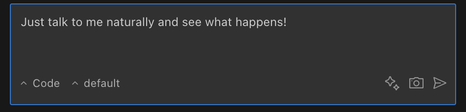
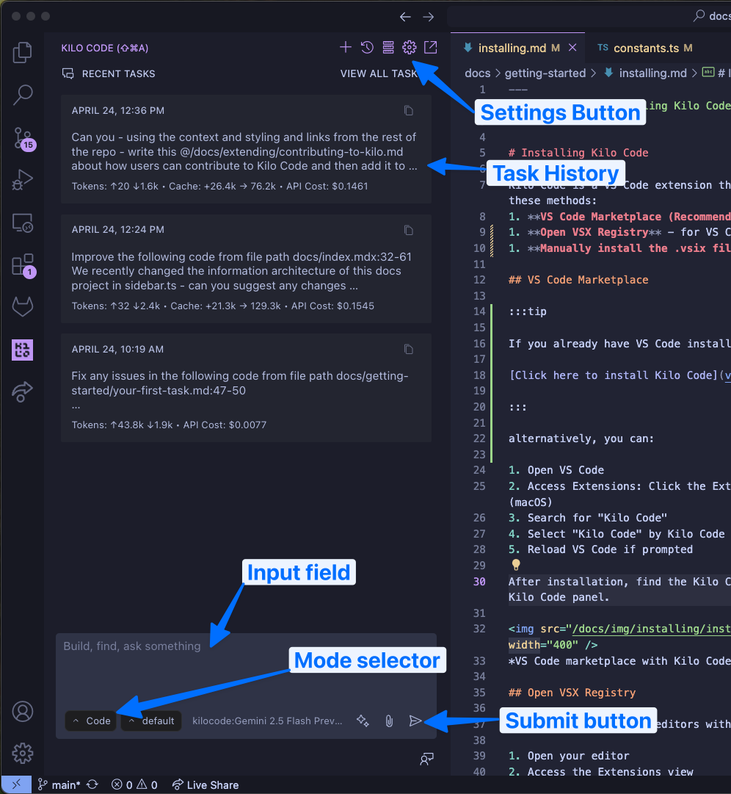
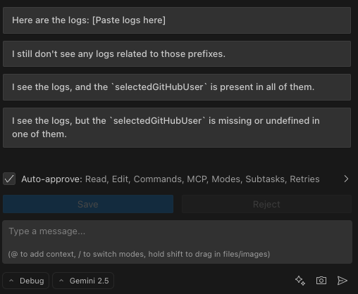
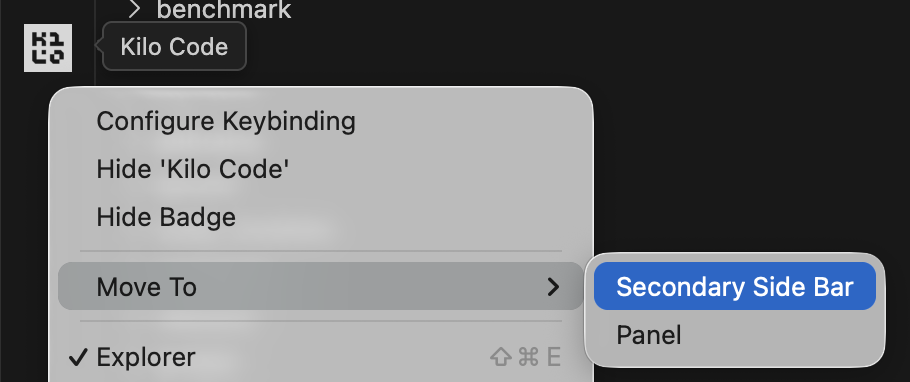

# Chatting with Kilo Code

> **Tip:** > **Bottom line:** Kilo Code is an AI coding assistant. You chat with it in plain English, and it writes, edits, and explains code for you.

> **Prefer quick completions?:**
> If you're typing code in the editor and want AI to finish your line or block, check out [Autocomplete](../features/autocomplete.md) instead. Chat is best for larger tasks, explanations, and multi-file changes.

## Quick Setup

Find the Kilo Code icon (Kilo Code) in VS Code's Primary Side Bar. Click it to open the chat panel.

**Lost the panel?** Go to View > Open View... and search for "Kilo Code"

## How to Talk to Kilo Code

**The key insight:** Just type what you want in normal English. No special commands needed.

_Example of typing a request in Kilo Code_

**Good requests:**

- `create a new file named utils.py and add a function called add that takes two numbers as arguments and returns their sum`
- `in the file @src/components/Button.tsx, change the color of the button to blue`
- `find all instances of the variable oldValue in @/src/App.js and replace them with newValue`

**What makes requests work:**

- **Be specific** - "Fix the bug in `calculateTotal` that returns incorrect results" beats "Fix the code"
- **Use @ mentions** - Reference files and code directly with `@filename`
- **One task at a time** - Break complex work into manageable steps
- **Include examples** - Show the style or format you want

> **Chat vs Autocomplete:** > **Use chat** when you need to describe what you want, ask questions, or make changes across multiple files.
>
> **Use [autocomplete](../features/autocomplete.md)** when you're already typing code and want the AI to finish your thought inline.

## The Chat Interface

_Everything you need is right here_

**Essential controls:**

- **Chat history** - See your conversation and task history
- **Input field** - Type your requests here (press Enter to send)
- **Action buttons** - Approve or reject Kilo's proposed changes
- **Plus button** - Start a new task session
- **Mode selector** - Choose how Kilo should approach your task

**Providing context with @-mentions:**

Reference files and other context directly in your message using `@`:

- `@file` - Reference a specific file
- `@url` - Include content from a URL
- `@problems` - Include current VS Code problems
- `@terminal` - Include terminal output
- `@git-changes` - Include uncommitted changes
- `@commit` - Reference a specific commit

## Quick Interactions

**Click to act:**

- File paths → Opens the file
- URLs → Opens in browser
- Messages → Expand/collapse details
- Code blocks → Copy button appears
- Mermaid code blocks → Fenced `mermaid` blocks render as diagrams after the message finishes streaming. The source remains copyable, and invalid Mermaid syntax stays visible in a contained error state.

**Status signals:**

- Spinning → Kilo is working
- Red → Error occurred
- Green → Success

## Common Mistakes to Avoid

| Instead of this...                | Try this                                                               |
| --------------------------------- | ---------------------------------------------------------------------- |
| "Fix the code"                    | "Fix the bug in `calculateTotal` that returns incorrect results"       |
| Assuming Kilo knows context       | Use `@` to reference specific files                                    |
| Multiple unrelated tasks          | Submit one focused request at a time                                   |
| Technical jargon overload         | Clear, straightforward language works best                             |
| Using chat for tiny code changes. | Use [autocomplete](../features/autocomplete.md) for inline completions |

**Why it matters:** Kilo Code works best when you communicate like you're talking to a smart teammate who needs clear direction.

## Suggested Responses

When Kilo Code needs more information to complete a task, it asks a follow-up question and often provides suggested answers to make responding faster.

**How it works:**

1. Kilo Code asks a question using the `ask_followup_question` tool.
2. Suggested answers appear as buttons below the question.
3. Click an answer to send it, or hold `Shift` while clicking to copy it into the input for editing.
   
   _Suggested responses appear as clickable buttons below questions_

**Benefits:**

- **Speed** - Quickly respond without typing full answers
- **Clarity** - Suggestions often clarify the type of information Kilo Code needs
- **Flexibility** - Edit suggestions to provide precise, customized answers when needed

This feature streamlines the interaction when Kilo Code requires clarification, allowing you to guide the task effectively with minimal effort.

## Tips for Better Workflow

> **Tip:** > **Move Kilo Code to the Secondary Side Bar** for a better layout. Right-click on the Kilo Code icon in the Activity Bar and select **Move To → Secondary Side Bar**. This lets you see the Explorer, Search, Source Control, etc. alongside Kilo Code.
>
> 
> _Move Kilo Code to the Secondary Side Bar for better workspace organization_

> **Tip:** > **Drag files directly into chat.** Once you have Kilo Code in a separate sidebar from the file explorer, you can drag files from the explorer into the chat window (even multiple at once). Just hold down the Shift key after you start dragging the files.

Ready to start coding? Start a session in Kilo Code and describe what you want to build!
