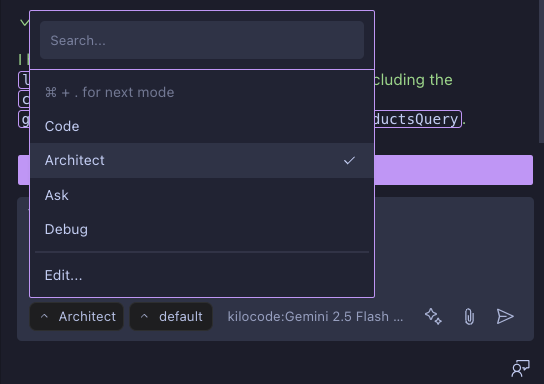
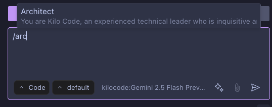
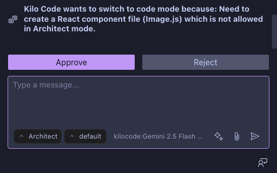

# Using Modes

Modes are specialized personas that tailor Kilo Code's behavior, capabilities, and tool access to the current task.

## Why Use Different Modes?

- **Task specialization:** Get precisely the type of assistance you need for your current task
- **Safety controls:** Prevent unintended file modifications when focusing on planning or learning
- **Focused interactions:** Receive responses optimized for your current activity
- **Workflow optimization:** Seamlessly transition between planning, implementing, debugging, and learning

## Switching Agents

[Watch the video](https://youtu.be/cS4vQfX528w)

Four ways to switch modes:

1. **Dropdown menu:** Click the selector to the left of the chat input

2. **Slash command:** Type `/modes` to list modes and switch. Type `/newtask` to create a new task, or `/smol` to condense your context window.

### Understanding /newtask vs /smol

Users often confuse `/newtask` and `/smol`. Here's the key difference:

| Command    | Purpose                                               | When to Use                                                             |
| ---------- | ----------------------------------------------------- | ----------------------------------------------------------------------- |
| `/newtask` | Creates a new task with context from the current task | When you want to start something new while carrying over context        |
| `/smol`    | Condenses your current context window                 | When your conversation is getting too long and you want to summarize it |

3. **Toggle command/Keyboard shortcut:** Use the keyboard shortcut below, applicable to your operating system. Each press cycles through the available modes in sequence, wrapping back to the first mode after reaching the end.

    | Operating System | Shortcut |
    | ---------------- | -------- |
    | macOS            | ⌘ + .    |
    | Windows          | Ctrl + . |
    | Linux            | Ctrl + . |

You can hold `shift` to move backwards through the list of modes, for example ⌘ + shift + on macOS.

4. **Accept suggestions:** Click on mode switch suggestions that Kilo Code offers when appropriate

## Built-in Agents

### Code Mode (Default)

| Aspect               | Details                                                                                                  |
| -------------------- | -------------------------------------------------------------------------------------------------------- |
| **Description**      | A skilled software engineer with expertise in programming languages, design patterns, and best practices |
| **Tool Access**      | Full access to all tool groups: `read`, `edit`, `browser`, `command`, `mcp`                              |
| **Ideal For**        | Writing code, implementing features, debugging, and general development                                  |
| **Special Features** | No tool restrictions—full flexibility for all coding tasks                                               |

### Ask Mode

| Aspect               | Details                                                                                           |
| -------------------- | ------------------------------------------------------------------------------------------------- |
| **Description**      | A knowledgeable technical assistant focused on answering questions without changing your codebase |
| **Tool Access**      | Limited access: `read`, `browser`, `mcp` only (cannot edit files or run commands)                 |
| **Ideal For**        | Code explanation, concept exploration, and technical learning                                     |
| **Special Features** | Optimized for informative responses without modifying your project                                |

### Architect Mode

| Aspect               | Details                                                                                              |
| -------------------- | ---------------------------------------------------------------------------------------------------- |
| **Description**      | An experienced technical leader and planner who helps design systems and create implementation plans |
| **Tool Access**      | Access to `read`, `browser`, `mcp`, and restricted `edit` (markdown files only)                      |
| **Ideal For**        | System design, high-level planning, and architecture discussions                                     |
| **Special Features** | Follows a structured approach from information gathering to detailed planning                        |

### Debug Mode

| Aspect               | Details                                                                             |
| -------------------- | ----------------------------------------------------------------------------------- |
| **Description**      | An expert problem solver specializing in systematic troubleshooting and diagnostics |
| **Tool Access**      | Full access to all tool groups: `read`, `edit`, `browser`, `command`, `mcp`         |
| **Ideal For**        | Tracking down bugs, diagnosing errors, and resolving complex issues                 |
| **Special Features** | Uses a methodical approach of analyzing, narrowing possibilities, and fixing issues |

> **Tip:** > **Keep debugging separate from main tasks:** When using Debug mode, ask Kilo to "start a new task in Debug mode with all of the necessary context needed to figure out X" so that the debugging process uses its own context window and doesn't pollute the main task.

### Orchestrator Mode

| Aspect               | Details                                                                                                             |
| -------------------- | ------------------------------------------------------------------------------------------------------------------- |
| **Description**      | A strategic workflow orchestrator who coordinates complex tasks by delegating them to appropriate specialized modes |
| **Tool Access**      | Limited access to create new tasks and coordinate workflows                                                         |
| **Ideal For**        | Breaking down complex projects into manageable subtasks assigned to specialized modes                               |
| **Special Features** | Uses the new_task tool to delegate work to other modes                                                              |

### Review Mode

| Aspect               | Details                                                                                                                           |
| -------------------- | --------------------------------------------------------------------------------------------------------------------------------- |
| **Description**      | An expert code reviewer specializing in analyzing changes to provide structured feedback on quality, security, and best practices |
| **Tool Access**      | Access to `read`, `browser`, `mcp`, and when permitted, `edit`                                                                    |
| **Ideal For**        | Catching issues early, enforcing code standards, accelerating PR turnaround                                                       |
| **Special Features** | Code review before committing, surfacing feedback across performance, security, style, and test coverage                          |

## Custom Agents

Create your own specialized assistants by defining tool access, file permissions, and behavior instructions. Custom agents help enforce team standards or create purpose-specific assistants. See [Custom Modes documentation](../../customize/custom-modes.md) for setup instructions.
