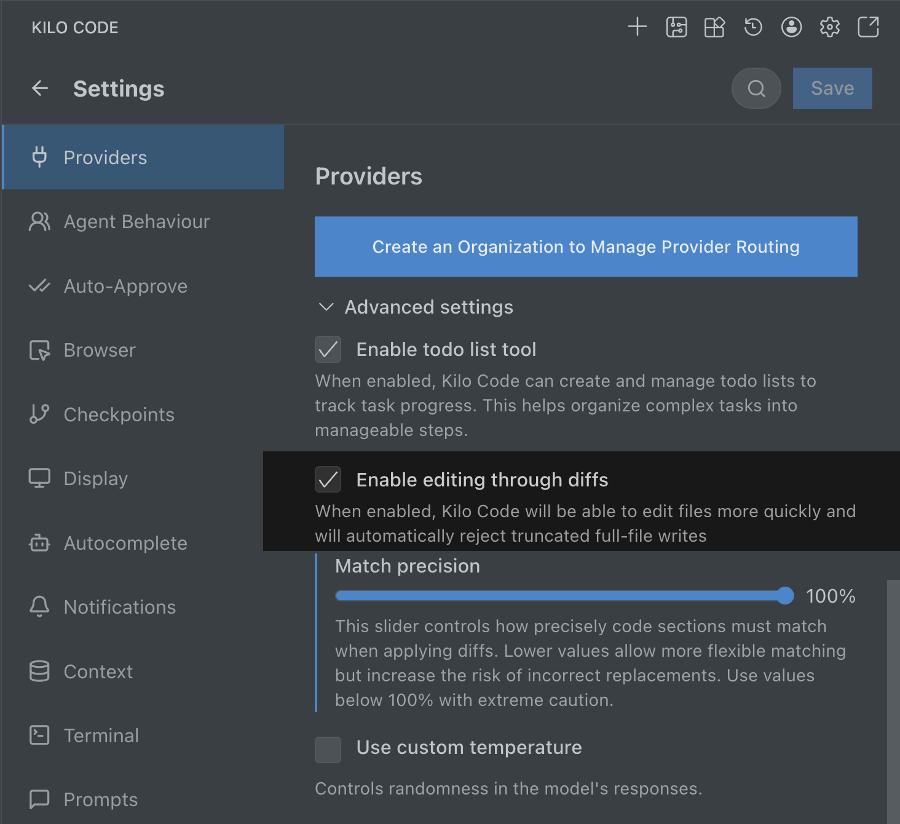
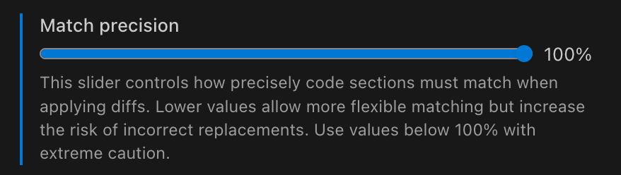

# Fast Edits

> **Default Setting:**
> Fast Edits (using the "Enable editing through diffs" setting) is enabled by default in Kilo Code. You typically don't need to change these settings unless you encounter specific issues or want to experiment with different diff strategies.

Kilo Code offers an advanced setting to change how it edits files, using diffs (differences) instead of rewriting entire files. Enabling this feature provides significant benefits.

## Enable Editing Through Diffs

Open Settings by clicking the gear icon gear icon → Advanced

When **Enable editing through diffs** is checked:

1.  **Faster File Editing**: Kilo modifies files more quickly by applying only the necessary changes.
2.  **Prevents Truncated Writes**: The system automatically detects and rejects attempts by the AI to write incomplete file content, which can happen with large files or complex instructions. This helps prevent corrupted files.

> **Disabling Fast Edits:**
> If you uncheck **Enable editing through diffs**, Kilo will revert to writing the entire file content for every edit using the [`write_to_file`](../../automate/tools/write-to-file.md) tool, instead of applying targeted changes with [`apply_diff`](../../automate/tools/apply-diff.md). This full-write approach is generally slower for modifying existing files and leads to higher token usage.

## Match Precision

This slider controls how closely the code sections identified by the AI must match the actual code in your file before a change is applied.

- **100% (Default)**: Requires an exact match. This is the safest option, minimizing the risk of incorrect changes.
- **Lower Values (80%-99%)**: Allows for "fuzzy" matching. Kilo can apply changes even if the code section has minor differences from what the AI expected. This can be useful if the file has been slightly modified, but **increases the risk** of applying changes in the wrong place.

**Use values below 100% with extreme caution.** Lower precision might be necessary occasionally, but always review the proposed changes carefully.

Internally, this setting adjusts a `fuzzyMatchThreshold` used with algorithms like Levenshtein distance to compare code similarity.
