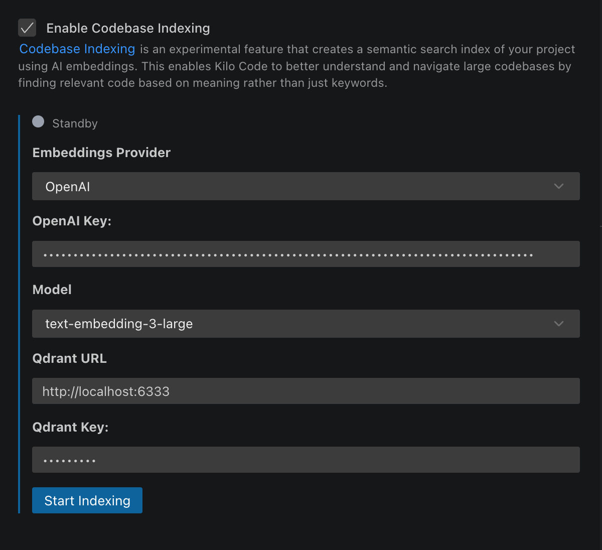

# Codebase Indexing

Codebase Indexing enables semantic code search across your entire project using AI embeddings. Instead of searching for exact text matches, it understands the _meaning_ of your queries, helping Kilo Code find relevant code even when you don't know specific function names or file locations.

> **Opt-in indexing:**
> Codebase Indexing is disabled by default. It starts only after you enable indexing globally or for an individual project. Configuring an embedding provider without enabling one of those toggles does not start indexing.

## What It Does

When enabled, the indexing system:

1. **Parses your code** using Tree-sitter to identify semantic blocks (functions, classes, methods)
2. **Creates embeddings** of each code block using AI models
3. **Stores vectors** in a vector database for fast similarity search
4. **Provides the [`semantic_search`](https://kilo.ai/docs/automate/tools/semantic-search) tool** to Kilo Code for intelligent code discovery

This enables natural language queries like "user authentication logic" or "database connection handling" to find relevant code across your entire project.

## Key Benefits

- **Semantic Search**: Find code by meaning, not just keywords
- **Enhanced AI Understanding**: Kilo Code can better comprehend and work with your codebase
- **Cross-Project Discovery**: Search across all files, not just what's open
- **Pattern Recognition**: Locate similar implementations and code patterns

## Setup

The legacy extension uses its own Codebase Indexing settings panel.

### Open Codebase Indexing Settings

1. In the chat header, click the database icon (indexing status).
2. The Codebase Indexing settings panel opens.
3. If you don't see the icon, open Kilo Code settings (gear icon) and search for **Codebase Indexing**.


_Codebase Indexing Settings (legacy)_

### Configure Settings

1. Enable **"Enable Codebase Indexing"** using the toggle switch.
2. Configure your embedding provider:
    - **OpenAI**: Enter API key and select model
    - **Gemini**: Enter Google AI API key and select embedding model
    - **Ollama**: Enter base URL and select model
3. Set Qdrant URL and optional API key.
4. Configure **Max Search Results** (default: 20, range: 1-100).
5. Click **Save** to start initial indexing.

### Embedding providers

The legacy extension supports a smaller set of providers:

| Provider           | How to use        | Notes                                                              |
| ------------------ | ----------------- | ------------------------------------------------------------------ |
| **OpenAI**         | API key           | Default: `text-embedding-3-small`.                                 |
| **Gemini**         | Google AI API key | Supports Gemini embedding models including `gemini-embedding-001`. |
| **Ollama (local)** | Local base URL    | No API costs.                                                      |

### Vector store

The legacy extension only supports **Qdrant**. See [Setting Up Qdrant](#setting-up-qdrant).

## Setting Up Qdrant

If you choose **Qdrant** as your vector store, you need a running Qdrant server.

### Quick Local Setup

**Using Docker:**

```bash
docker run -p 6333:6333 qdrant/qdrant
```

**Using Docker Compose:**

```yaml
version: "3.8"
services:
    qdrant:
        image: qdrant/qdrant
        ports:
            - "6333:6333"
        volumes:
            - qdrant_storage:/qdrant/storage
volumes:
    qdrant_storage:
```

### Production Deployment

For team or production use:

- [Qdrant Cloud](https://cloud.qdrant.io/) — managed service
- Self-hosted on AWS, GCP, or Azure
- Local server with network access for team sharing

## Understanding Index Status

The interface shows real-time status:

- **Standby**: Not running, awaiting configuration or paused
- **In Progress**: Currently processing files (with a progress percentage and `processed/total` count)
- **Complete**: Up-to-date and ready for searches
- **Error**: Failed state, with an error message
- **Disabled**: Indexing is turned off or not yet configured

## How Files Are Processed

### Smart Code Parsing

- **Tree-sitter Integration**: Uses AST parsing to identify semantic code blocks
- **Language Support**: Broad language coverage via Tree-sitter — C, C#, C++, CSS, Elisp, Elixir, Go, HTML, Java, JavaScript, Kotlin, Lua, OCaml, PHP, Python, Ruby, Rust, Scala, Solidity, Swift, SystemRDL, TLA+, TOML, TSX, TypeScript, Vue, Zig, and more
- **Markdown Support**: Dedicated parser for markdown and documentation
- **Fallback**: Line-based chunking for unsupported file types
- **Block Sizing**:
    - Minimum: 100 characters
    - Maximum: 1,000 characters
    - Splits large functions intelligently

### Automatic File Filtering

The indexer automatically excludes:

- Binary files and images
- Large files (&gt;1MB)
- Git repositories (`.git` folders)
- Dependencies (`node_modules`, `vendor`, etc.)
- Files matching `.gitignore` and [`.kilocodeignore`](kilocodeignore.md) patterns

### Incremental Updates

- **File Watching**: Monitors the workspace for changes and re-indexes in the background
- **Smart Updates**: Only reprocesses modified files
- **Hash-based Caching**: Avoids reprocessing unchanged content
- **Branch Switching**: Automatically handles Git branch changes

## Using indexed search

After indexing completes, Kilo Code can use `semantic_search` to find relevant code by meaning.
