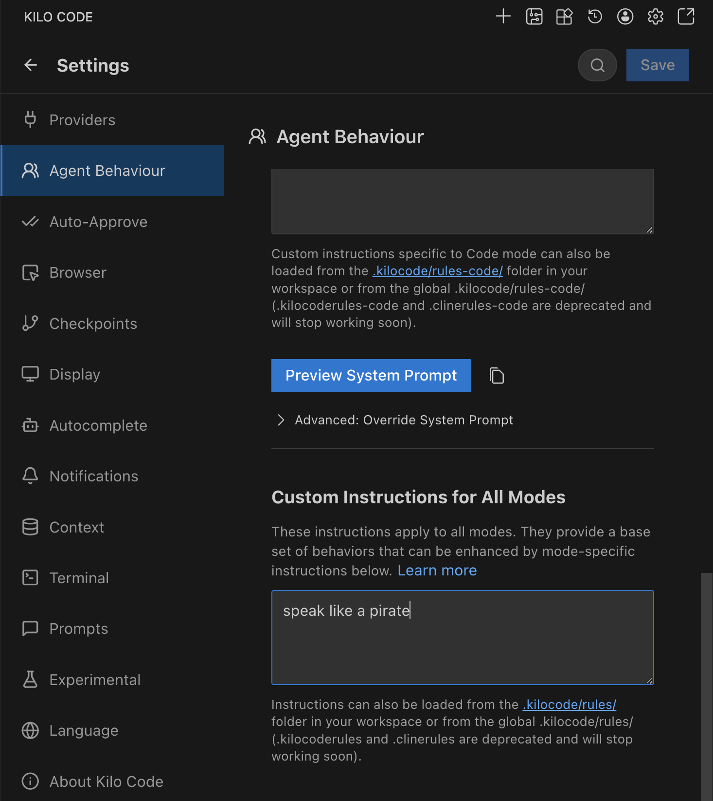
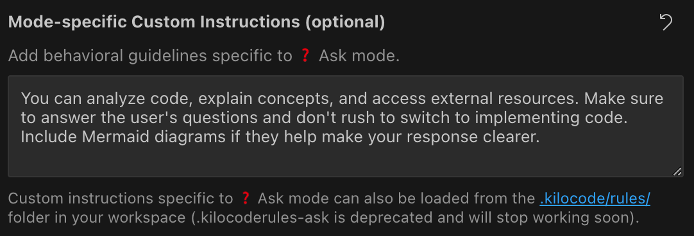

# Custom Instructions

Custom Instructions personalize how Kilo Code behaves by providing guidance that shapes responses, coding style, and decisions.

## What Are Custom Instructions?

Custom Instructions define specific Extension behaviors, preferences, and constraints beyond Kilo's basic role definition. Examples include coding style, documentation standards, testing requirements, and workflow guidelines.

## Setting Custom Instructions

> **Custom Instructions vs Rules:**
> Custom Instructions are IDE-wide and are applied across all workspaces and maintain your preferences regardless of which project you're working on. Unlike Instructions, [Custom Rules](custom-rules.md) are project specific and allow you to setup workspace-based ruleset.

**How to set them:**

_Kilo Code Modes tab showing global custom instructions interface_

1.  **Open Modes Tab:** Click the notebook icon icon in the Kilo Code top menu bar
2.  **Find Section:** Find the "Custom Instructions for All Modes" section
3.  **Enter Instructions:** Enter your instructions in the text area
4.  **Save Changes:** Click "Done" to save your changes

#### Mode-Specific Instructions

Mode-specific instructions can be set using the Modes Tab

_Kilo Code Modes tab showing mode-specific custom instructions interface_
_ **Open Tab:** Click the notebook icon icon in the Kilo Code top menu bar
_ **Select Mode:** Under the Modes heading, click the button for the mode you want to customize
_ **Enter Instructions:** Enter your instructions in the text area under "Mode-specific Custom Instructions (optional)"
_ **Save Changes:** Click "Done" to save your changes

> **Global Mode Rules:**
>
> If the mode itself is global (not workspace-specific), any custom instructions you set for it will also apply globally for that mode across all workspaces.

#### Mode-Specific Instructions from Files

For version-controlled mode instructions, use the mode rules file paths documented in [Custom Modes](custom-modes.md#mode-specific-instructions-via-filesdirectories):

- Preferred: `.kilo/rules-{mode-slug}/` (directory)
- Fallback: `.kilocoderules-{mode-slug}` (single file)

> **Legacy Naming Note:**
> Only `.kilocoderules-{mode-slug}` is recognized as the legacy fallback. Older naming like `.clinerules-{mode-slug}` is not supported.

## Related Features

- [Custom Modes](custom-modes.md)
- [Custom Rules](custom-rules.md)
- [Settings Management](../getting-started/settings.md)
- [Auto-Approval Settings](../getting-started/settings/auto-approving-actions.md)

## Compatibility anchors

These headings preserve links emitted by the final legacy IDE builds.

### Global rules directory

See the corresponding setting or workflow described on this page.

### Setting up global rules

See the corresponding setting or workflow described on this page.
