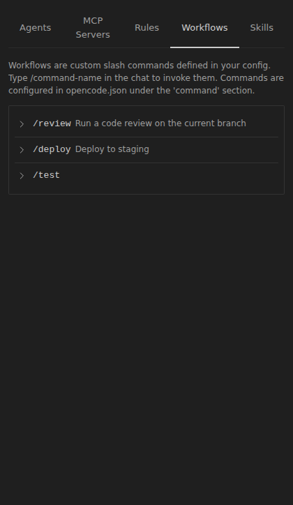

# Workflows

Workflows (also called **slash commands** in the new extension) automate repetitive tasks by defining step-by-step instructions for Kilo Code to execute.


_Workflows tab in Kilo Code_

## Creating Workflows

Workflows are markdown files stored in `.kilocode/workflows/`:

- **Global workflows**: `~/.kilocode/workflows/` (available in all projects)
- **Project workflows**: `[project]/.kilocode/workflows/` (project-specific)

### Basic Setup

1. Create a `.md` file with step-by-step instructions
2. Save it in your workflows directory
3. Type `/filename.md` to execute

### Workflow Capabilities

Workflows can leverage:

- [Built-in tools](../automate/tools.md): [`read_file()`](../automate/tools/read-file.md), [`search_files()`](../automate/tools/search-files.md), [`execute_command()`](../automate/tools/execute-command.md)
- CLI tools: `gh`, `docker`, `npm`, custom scripts
- [MCP integrations](https://kilo.ai/docs/automate/mcp/overview): Slack, databases, APIs
- [Agent switching](../code-with-ai/agents/using-agents.md): [`new_task()`](../automate/tools/new-task.md) for specialized contexts

## Common Workflow Patterns

**Release Management**

```markdown
1. Gather merged PRs since last release
2. Generate changelog from commit messages
3. Update version numbers
4. Create release branch and tag
5. Deploy to staging environment
```

**Project Setup**

```markdown
1. Clone repository template
2. Install dependencies (`npm install`, `pip install -r requirements.txt`)
3. Configure environment files
4. Initialize database/services
5. Run initial tests
```

**Code Review Preparation**

```markdown
1. Search for TODO comments and debug statements
2. Run linting and formatting
3. Execute test suite
4. Generate PR description from recent commits
```

## Example: PR Submission Workflow

Let's walk through creating a workflow for submitting a pull request.

Create a file called `submit-pr.md` in your `.kilocode/workflows` directory:

```markdown
# Submit PR Workflow

You are helping submit a pull request. Follow these steps:

1. First, use `search_files` to check for any TODO comments or console.log statements that shouldn't be committed
2. Run tests using `execute_command` with `npm test` or the appropriate test command
3. If tests pass, stage and commit changes with a descriptive commit message
4. Push the branch and create a pull request using `gh pr create`
5. Use `ask_followup_question` to get the PR title and description from the user

Parameters needed (ask if not provided):

- Branch name
- Reviewers to assign
```

Trigger this workflow by typing `/submit-pr.md` in the chat.

Kilo Code will:

- Scan your code for common issues before committing
- Run your test suite to catch problems early
- Handle the Git operations and PR creation
- Set up follow-up tasks for deployment

This saves you from manually running the same steps every time you want to submit code for review.
