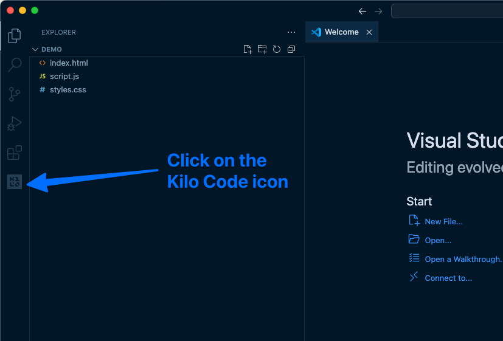
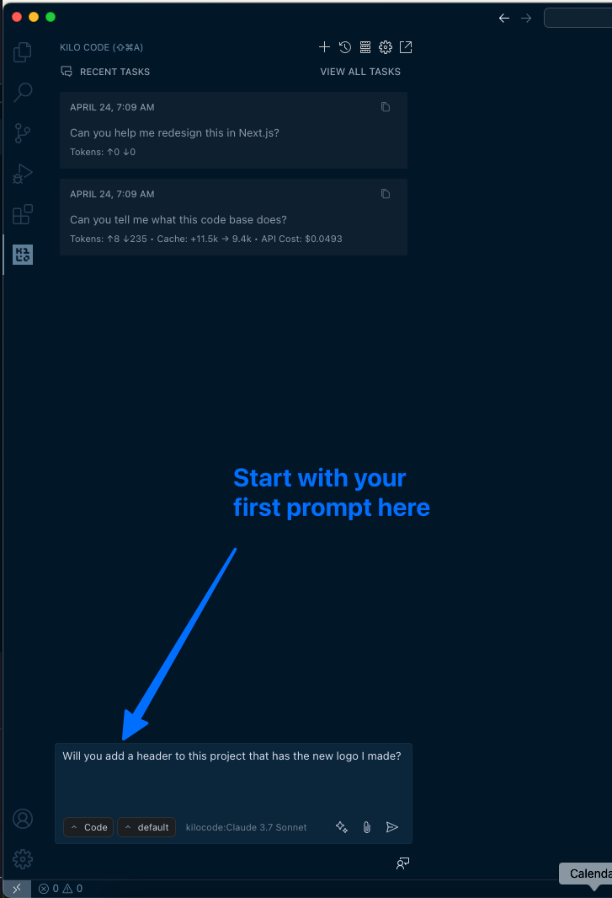
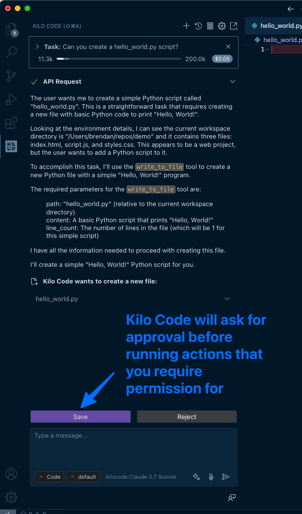
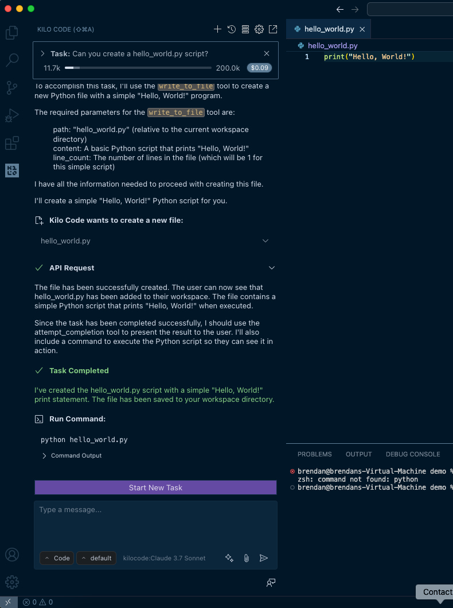

# Quickstart

After you [set up Kilo Code](setup-authentication.md), follow the guide for your platform below.

## Video Tour

[Watch the video](https://www.youtube.com/watch?v=pO7zRLQS-p0)

## Step by Step Guide

### Step 1: Open Kilo Code

Click the Kilo Code icon (Kilo Code) in the VS Code Primary Side Bar (vertical bar on the side of the window) to open the chat interface. If you don't see the icon, verify the extension is [installed](installing.md) and enabled.

_The Kilo Code icon in the Primary Side Bar opens the chat interface._

### Step 2: Type Your Task

Type a clear, concise description of what you want Kilo Code to do in the chat box at the bottom of the panel. Examples of effective tasks:

- "Create a file named `hello.txt` containing 'Hello, world!'."
- "Write a Python function that adds two numbers."
- "Create an HTML file for a simple website with the title 'Kilo test'"

No special commands or syntax needed—just use plain English.

> **Optional: Try Autocomplete:**
> While chat is great for complex tasks, Kilo Code also offers **inline autocomplete** for quick code suggestions. Open any code file, start typing, and watch for ghost text suggestions. Press `Tab` to accept. [Learn more about Autocomplete →](../code-with-ai/features/autocomplete.md)

_Enter your task in natural language - no special syntax required._

### Step 3: Send Your Task

Press Enter or click the Send icon (send icon) to the right of the input box.

### Step 4: Review & Approve Actions

Kilo Code analyzes your request and proposes specific actions. These may include:

- **Reading files:** Shows file contents it needs to access
- **Writing to files:** Displays a diff with proposed changes (added lines in green, removed in red)
- **Executing commands:** Shows the exact command to run in your terminal
- **Using the Browser:** Outlines browser actions (click, type, etc.)
- **Asking questions:** Requests clarification when needed to proceed

_Kilo Code shows exactly what action it wants to perform and waits for your approval._

- In **Code** mode, writing capabilities are on by default.
- In **Architect** and **Ask** modes, Kilo Code won't write code.

> **Tip:**
> The level of autonomy is configurable, allowing you to make the agent more or less autonomous.
>
> You can learn more about [using agents](../code-with-ai/agents/using-agents.md) and [auto-approving actions](settings/auto-approving-actions.md).

### Step 5: Iterate

Kilo Code works iteratively. After each action, it waits for your feedback before proposing the next step. Continue this review-approve cycle until your task is complete.

_After completing the task, Kilo Code shows the final result and awaits your next instruction._

## Conclusion

You've completed your first task. Along the way you learned:

- How to interact with Kilo Code using natural language
- Why approval keeps you in control
- How iteration lets the AI refine its work

Ready for more? Here are some next steps:

- **[Autocomplete](../code-with-ai/features/autocomplete.md)** — Get inline code suggestions as you type
- **[Agents](../code-with-ai/agents/using-agents.md)** — Explore different agents for different tasks
- **[Git commit generation](../code-with-ai/features/git-commit-generation.md)** — Automatically generate commit messages

> **Tip:** > **Accelerate development:** Check out multiple copies of your repository and run Kilo Code on all of them in parallel (using git to resolve any conflicts, same as with human devs). This can dramatically speed up development on large projects.
