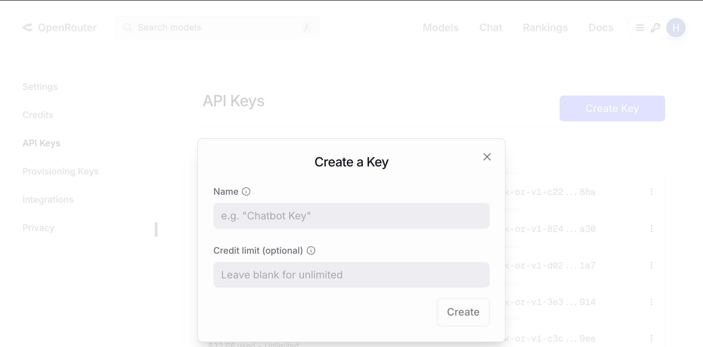
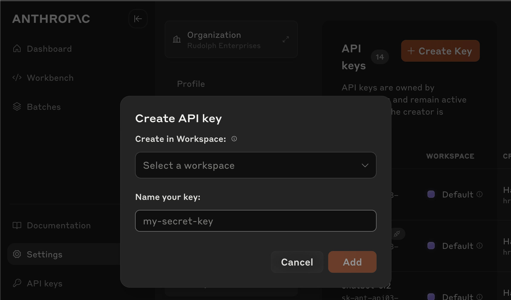
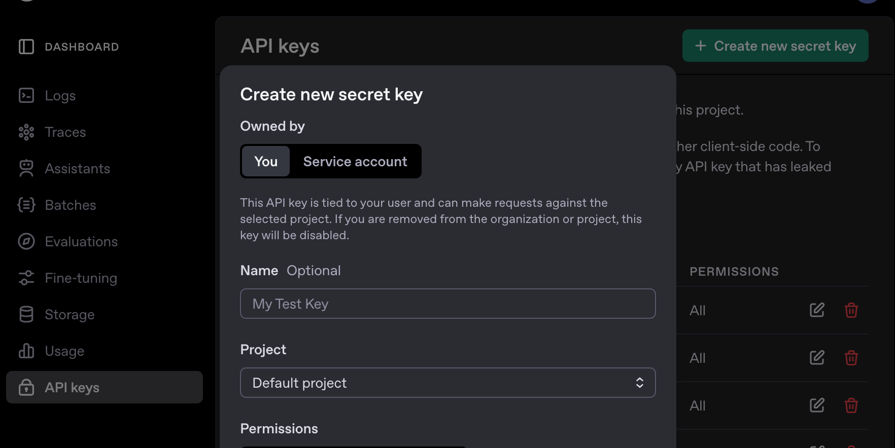

# Setup & Authentication

When you install Kilo Code, you'll be prompted to sign in or create a free account. This automatically configures everything you need to get started.

## Quick Start with Kilo Account

1. Click **"Try Kilo Code for Free"** in the extension
2. Sign in with your Google account
3. Allow VS Code to open the authorization URL

That's it! You're ready to [start your first task](quickstart.md).

> **Add Credits:** > [Add credits to your account](https://app.kilo.ai/profile), or sign up for [Kilo Pass](https://kilo.ai/features/kilo-pass).

## Kilo Gateway API Key

If you're using the [Kilo AI Gateway](https://kilo.ai/docs/gateway) outside of the Kilo Code extension (for example, with the Vercel AI SDK or OpenAI SDK), you'll need an API key:

1. Go to [app.kilo.ai](https://app.kilo.ai)
2. Go to **Your Profile** on your **personal account** (not in an organization)
3. Scroll to the bottom of the page
4. Copy your API key

## Using Another API Provider

If you prefer to use your own API key or existing subscription, Kilo Code supports **over 30 providers**. Here are some popular options to get started:

| Provider                                                       | Best For                            | API Key Required |
| -------------------------------------------------------------- | ----------------------------------- | ---------------- |
| [ChatGPT Plus/Pro](../ai-providers/openai-chatgpt-plus-pro.md) | Use your existing subscription      | No               |
| [OpenRouter](../ai-providers/openrouter.md)                    | Access multiple models with one key | Yes              |
| [Anthropic](../ai-providers/anthropic.md)                      | Direct access to Claude models      | Yes              |
| [OpenAI](../ai-providers/openai.md)                            | Access to GPT models                | Yes              |

> **Many More Providers Available:**
> These are just a few examples! Kilo Code supports many more providers including Google Gemini, DeepSeek, Mistral, Ollama (for local models), AWS Bedrock, Google Vertex, and more. See the complete list at [AI Providers](../ai-providers/README.md).

### ChatGPT Plus/Pro Subscription

Already have a ChatGPT subscription? You can use it with Kilo Code through the [OpenAI ChatGPT provider](../ai-providers/openai-chatgpt-plus-pro.md)—no API key needed.

### OpenRouter

1. Go to [openrouter.ai](https://openrouter.ai/) and sign in
2. Navigate to [API keys](https://openrouter.ai/keys) and create a new key
3. Copy your API key

_Create and copy your OpenRouter API key_

### Anthropic

1. Go to [console.anthropic.com](https://console.anthropic.com/) and sign in
2. Navigate to [API keys](https://console.anthropic.com/settings/keys) and create a new key
3. Copy your API key immediately—it won't be shown again

_Copy your Anthropic API key immediately after creation_

### OpenAI

1. Go to [platform.openai.com](https://platform.openai.com/) and sign in
2. Navigate to [API keys](https://platform.openai.com/api-keys) and create a new key
3. Copy your API key immediately—it won't be shown again

_Copy your OpenAI API key immediately after creation_

### Configuring Your Provider

1. Click the Kilo Code icon in the VS Code sidebar
2. Select your API provider from the dropdown
3. Paste your API key
4. Choose your model
5. Click **"Let's go!"**

> **Need Help?:**
> Reach out to our [support team](mailto:hi@kilo.ai) or join our [Discord community](https://kilo.ai/discord).
